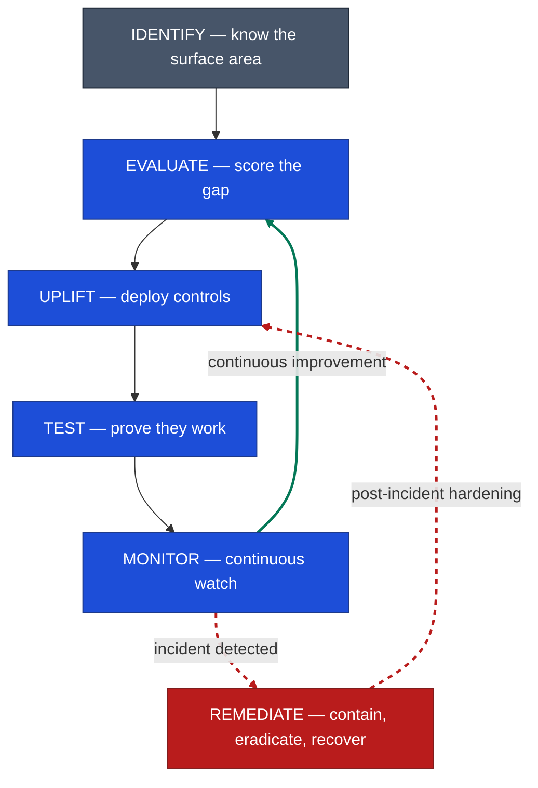

# M365 Security Lifecycle — Diagram & Notes

---

## Diagram as Mermaid (editable, version-controlled)

---

## Why this shape

### 1. The **continuous improvement loop** (Monitor → Evaluate)

Monitoring isn't an endpoint — it's the input to the next evaluation. Secure Score changes, new CVEs appear, the threat landscape shifts, customer scope evolves. The whole point of MONITOR is to feed observations *back* into EVALUATE so the cycle restarts with sharper inputs.

> Without this loop, you have a project. With it, you have a service.

### 2. The **incident/hardening loop** (Monitor → Remediate → Uplift)

REMEDIATE is not part of the steady-state cycle — it's an **exception path** triggered when MONITOR sees something real. After remediation, the lesson must feed back into UPLIFT (new control, tuned policy, additional detection) — otherwise the same incident repeats.

> Remediation without hardening is just clean-up. Remediation that feeds Uplift is improvement.

---

1. **Trace the forward path** — IDENTIFY (once per customer) then the four-phase loop.
2. **Then trace the green loop** — "this is what makes it a *service*, not a project."
3. **Then trace the red exception** — "this is what makes it *resilient*, not just reactive."

The forward arrows are the deal. The two feedback arrows are the difference between a junior MSP and a mature one.

---
